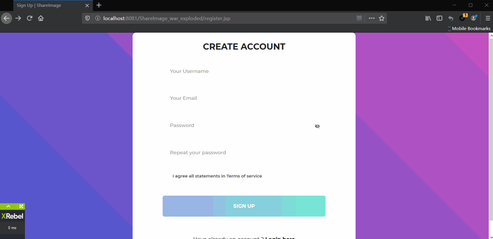

# ShareImage

ShareImage - Online Image Sharing Platform

---
<!-- TOC -->

- [ShareImage](#shareimage)
  - [Overview](#overview)
  - [Design Document](#design-document)
    - [Role Supported](#role-supported)
    - [Functionalities](#functionalities)
    - [Technology Stack](#technology-stack)
  - [Object Design](#object-design)
    - [ER Diagram](#er-diagram)
  - [Structure](#structure)
  - [API Design](#api-design)
    - [API Specification](#api-specification)
  - [Page Design](#page-design)
  - [Deployment](#deployment)
    - [Default Database configuration](#default-database-configuration)
  - [Demo](#demo)
  - [To-Do](#to-do)
  - [Ref](#ref)

<!-- /TOC -->

## Overview

ShareImage is an online image sharing platform where people can post, comment, and share images. Users can tag the images with different categories and view images by categories.

## Design Document

### Role Supported
User: 
1.	Users can post, update, delete, search, share, and download images.
2.	Users can post and delete comments.
Admin: 
1.	Admin can do what the user can do.
2.	Admin can delete any image/comment.


### Functionalities
1.	User registration.
2.	Update user information (avatar, first name, last name, gender, password). (authenticated)
3.	User can upload and create an image. (authenticated)
4.	Update image information (title, tags, description). (authenticated)
5.	User can delete his/her image. (authenticated)
6.	User can post a comment under an image. (authenticated)
7.	User can delete his/her comments. (authenticated)
8.	User can search images by title/username/tag
9.	Tags of an image are clickable and can be used to group by images with the same tag.
10.	Any unexpected operation will be blocked and handled correctly.


### Technology Stack
- Front End: JSP, HTML, CSS, JavaScript
- Front End Framework: BootStrap, JQuery, Toastr, addToany, Bootstrap Pagination Plugin, Spring MVC, Spring Security, JUnit
- Data Tier/Middle Tier: MySQL, Hibernate, Tomcat
- Version Control: Git


---

## Object Design

**User**
| Attribute        | Type               | Note                  |
|------------------|--------------------|-----------------------|
| userId           | string             | PK                    |
| username         | string             | must be unique        |
| email            | string             | must be unique        |
| password         | string             |                       |
| profileImagePath | string             | path of profile image |
| firstName        | string             |                       |
| lastName         | string             |                       |
| gender           | string             |                       |
| createTime       | date               |                       |
| updateTime       | date               |                       |
| comments         | Set&lt;Comment&gt; |                       |
| images           | Set&lt;Image&gt;   |                       |

**Image**
| Attribute         | Type   | Note                |
|-------------------|--------|---------------------|
| imageId           | string | PK                  |
| user              | User   | FK                  |
| title             | string |                     |
| path              | string | path of image       |
| type (image type) | string | image format        |
| resolutionW       | int    | weight of image(px) |
| resolutionH       | int    | height of image(px) |
| views             | int    | no. imgae viewed    |
| downloads         | int    | no. image download  |
| tags              | string |                     |
| description       | string |                     |
| username          | string | username of owner   |
| createTime        | date   |                     |
| updateTime        | date   |                     |
| numComments       | int    | number of comments  |

**Comment**
| Attribute  | Type   | Note              |
|------------|--------|-------------------|
| commentId  | string | PK                |
| user       | User   | FK                |
| imageId    | string | FK                |
| username   | string | username of owner |
| createTime | date   |                   |
| updateTime | date   |                   |
| content    | string |                   |

### ER Diagram


## Structure


## API Design

| A | method | uri                            | note                                       | Progress |
|---|--------|--------------------------------|--------------------------------------------|----------|
| * | DELETE | /v1/admin/deleteComment        | AdminTool to delete comment                | ✅        |
| * | DELETE | /v1/admin/deleteImage          | AdminTool to delete image                  | ✅        |
|   | POST   | /v1/user                       | Create a user                              | ✅        |
|   | GET    | /v1/user/avatar/{username}     | Get user avatar path                       | ✅        |
| * | GET    | /v1/user/self                  | Get user information                       | ✅        |
| * | PUT    | /v1/user/self                  | Update user information                    | ✅        |
| * | POST   | /v1/image                      | Create a image                             | ✅        |
|   | GET    | /v1/image/all/{pageNum}        | Retrive one page image data off all images | ✅        |
|   | GET    | /v1/image/search               | Search image                               | ✅        |
|   | GET    | /v1/image/{imageId}            | Get a image                                | ✅        |
| * | PUT    | /v1/image/{imageId}            | Update image information                   | ✅        |
| * | DELETE | /v1/image/{imageId}            | Delete the image                           | ✅        |
|   | GET    | /v1/image/{imageId}/allComment | Get all comment belong to the image        | ✅        |
| * | POST   | /v1/image/{imageId}/comment    | Create a comment for a image               | ✅        |
|   | GET    | /v1/image/download/{imageId}   | Download a image file                      | ✅        |
|   | GET    | /v1/comment/{commentId}        | Get a comment                              | ✅        |
| * | PUT    | /v1/comment/{commentId}        | Update a comment                           | ❌        |
| * | DELETE | /v1/comment/{commentId}        | Delete the comment                         | ✅        |

`* denotes an authenticated API; otherwise is a public API by default;`

`📝: In Design;  🚧: Implementing; ✅: Done; ❌: No Plan to Support` 

### API Specification

[Go here to view API Specification](https://app.swaggerhub.com/apis-docs/LxChris/ShareImage/1.0.0)

## Page Design

| A | method | uri                             | note                           | Target JSP Page | Progress |
|---|--------|---------------------------------|--------------------------------|-----------------|----------|
|   | GET    | /                               | Index                          | index.jsp       | ✅        |
|   | GET    | Does not exist uri              | 404 Not found                  | 404.jsp         | ✅        |
|   | GET    | /v1/index                       | Index page                     | index.jsp       | ✅        |
|   | GET    | /v1/logout                      | Log out                        | logout.jsp      | ✅        |
|   | GET    | /v1/view/404                    | 404 not found page             | 404.jsp         | ✅        |
| * | GET    | /v1/view/adminTool              | Admin tool page                | adminTool.page  | ✅        |
|   | GET    | /v1/view/image/{imageId}        | View image in page             | imageDetail.jsp | ✅        |
| * | GET    | /v1/view/image/update/{imageId} | Update a image                 | updateImage.jsp | ✅        |
|   | GET    | /v1/view/login                  | Login page                     | loginPage.jsp   | ✅        |
| * | GET    | /v1/view/profile                | Profile page                   | profile.jsp     | ✅        |
|   | GET    | /v1/view/register               | Register page                  | register.jsp    | ✅        |
|   | GET    | /v1/view/search                 | Search image page              | search.jsp      | ✅        |
| * | GET    | /v1/view/self/images            | View current user upload image | myImage.jsp     | ✅        |
| * | GET    | /v1/view/uploadImage            | Upload a image                 | uploadImage.jsp | ✅        |

`📝: In Design;  🚧: Implementing; ✅: Done; ❌: No Plan to Support` 

## Deployment

1. Go `src\main\resources` to modify the database setting. *(The program will create the schema if it is not exist)*
2. Run tests under `src\test` to make sure the model, Dao, Service, and Controller work correctly. *(Tests use the h2 in-memory database so it will affect the data in your database)*

### Default Database configuration

| Name             | Value      |
|------------------|------------|
| Database Address | localhost  |
| Port             | 3306       |
| Username         | root       |
| Password         | root       |
| Scehma           | shareImage |

## Demo
<!-- 




 -->

## To-Do

- [x] Model setup
- [x] DAO setup
- [x] Service setup
- [x] SQL setup
- [x] Resource mapping setup
- [x] Spring security setup
- [x] ER diagram, user add password
- [x] Modify code need to update README
  - User: id -> userId; 
  - Comment: id - > commentId, author -> userId
- [ ] API design
  - UserDetailService:
    - [x] ~~support loging via username/email~~ (Only username supported)
  - ImageService:
    - [x] Save image need to save username
  - CommentService:
    - [x] Save comment need to save username
- Front-end
  - header:
    - [x] when reduce the width, there is a bug of the search bar
  - footer:
    - [x] when reduce the width the save button will be hidden by the footer in **profile** page
  - register page:
    - [x] don't use `alert` in validation
  - profile page:
    - [x] when updatting gender, hacker can modify page content to change the value of "Gender"
- [ ] Back-end
  - [x] User:
    - Initial: username, email, password not null
    - [x] When update email need to check whether email exist
    - [x] Update user profile
    - [x] Upload file exceed size error handle
    - [x] Update user email is not **available**
  - [ ] Image:
    - [x] controller post comment return sensitive data: like user info need to do something
    - [x] Store upload file correctly
    - [x] When updating avatar delete the old file
- [ ] Add images in readme for demo
- [ ] Most Viewed Images and Recently Uploaded Images API
- [ ] Bug
  - [ ] register page duplicate error msg: 1. page one 2. pop up notification


## Ref

[Spring MVC + Hibernate Development](https://www.cnblogs.com/xrog/p/6359706.html)

[Spring MVC + Hibernate + MYSQL Maven using annotation](http://websystique.com/springmvc/spring-4-mvc-and-hibernate4-integration-example-using-annotations/)

[Spring MVC + Spring Security 4 + BootStrap](http://websystique.com/springmvc/spring-mvc-4-and-spring-security-4-integration-example/)

[Spring MVC CRUD Example](https://www.journaldev.com/3531/spring-mvc-hibernate-mysql-integration-crud-example-tutorial)


https://blog.csdn.net/flowingflying/article/details/81509438

**Bootstrap**

https://startbootstrap.com/previews/heroic-features/

https://startbootstrap.com/themes/landing-page/

https://startbootstrap.com/themes/

https://startbootstrap.com/themes/landing-pages/

https://bootstrapmade.com/

https://www.w3schools.com/bootstrap/bootstrap_templates.asp

http://media-feeds.extracoding.com/blog/

http://blog.sina.com.cn/s/blog_625d79410101dbdd.html

https://blog.csdn.net/liyiming2017/article/details/90218062

**Front and Back**

https://github.com/IcedSoul/Shopping

https://w3layouts.com/ecommerce-online-shopping-mobile-website-templates/

https://w3layouts.com/baggage-an-ecommerce-category-bootstrap-responsive-web-template/

https://w3layouts.com/pakhi-a-flat-ecommerce-bootstrap-responsive-web-template/

https://themehunt.com/items/ecommerce/latest?start=21

https://wowslider.com/posts/35-top-free-bootstrap-templates-2016-95.html

https://wowslider.com/posts/35-top-free-bootstrap-templates-2016-95.html

**Image Upload**

https://plugins.krajee.com/file-input/demo#top

*With Progress Bar*

https://blog.csdn.net/Muscleheng/article/details/77898795

**Image Editor**

https://github.com/nhn/tui.image-editor

https://github.com/nhn/tui.image-editor/issues/226

http://nhn.github.io/tui.image-editor/latest/ImageEditor#toDataURL

https://www.powr.io/plugins/photo-editor/standalone?id=23698472&

https://github.com/meltingice/CamanJS/

http://camanjs.com/

https://github.com/viliusle/miniPaint

**Scroll down to load more image**

https://blog.csdn.net/smartsmile2012/article/details/39343361

https://blog.csdn.net/smartsmile2012/article/details/39343361

**Image overlay on hover**

https://miketricking.github.io/bootstrap-image-hover/

**Bootstrap pagination plugin**

https://www.jqueryscript.net/other/Simple-Customizable-Pagination-Plugin-with-jQuery-Bootstrap-Twbs-Pagination.html

below plugin cannot handle zero total page

https://stackoverflow.com/questions/31288848/twbs-pagination-start-page-option-is-incorrect

**Share Plugin**

https://www.addtoany.com/buttons/for/website

**Toastr Notification Plugin**

https://github.com/CodeSeven/toastr

execute function after timeout

```javascript
toastr.success(
  'Have fun!',
  'Miracle Max Says',
  {
    timeOut: 1000,
    fadeOut: 1000,
    onHidden: function () {
        window.location.reload();
      }
  }
);
```